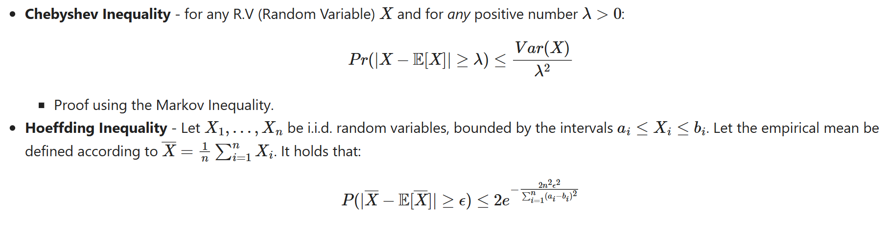
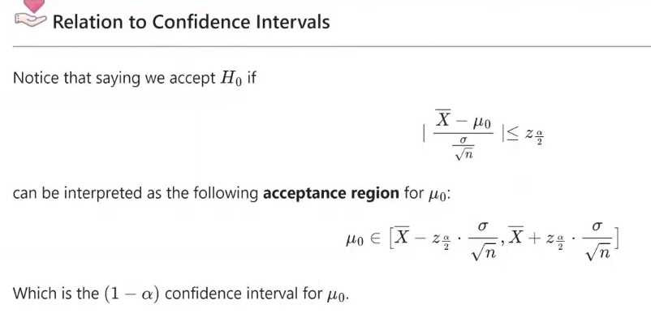

Here I'll put all the things I must do in order to get the exercise done

1. tutorials given in the readme of the ex
    Tutorial 2. Point Estimation: https://github.com/taldatech/ee046202-unsupervised-learning-data-analysis/blob/master/ee046202_tutorial_01_classic_statistics_point_estimation.ipynb
    Tutorial 3. Confidence intervals, error bounds: https://github.com/taldatech/ee046202-unsupervised-learning-data-analysis/blob/master/ee046202_tutorial_02_classic_statistics_confidence_intervals.ipynb

2. Problem 1
3. Problem 2
4. Problem 3
5. Extend with some extra materials:
    https://quantumalgorithms.org/chapter-intro.html (chapter 2.3)
    video of the lecture

some information obtained from the tutorials / practical class...:
 1. 
 2. https://www.youtube.com/watch?v=zz4C-xECIp4
 3. https://www.youtube.com/watch?v=s8geHBRvSos
 4. https://en.wikipedia.org/wiki/68%E2%80%9395%E2%80%9399.7_rule
 5. https://github.com/Qiskit/textbook  and https://github.com/tybens/quantum-data-fitting-HHL (general tutorials, not needed now. they're not updated and they could have many mistakes)
 6. THE MOST IMPORTANT!!!
    the main thing we're going to review is how to compute error bars / confidence interval
    about the random data we generate we can compute the average / mean... and we want to give an error bar to this number. in section 6.1 we have some methods / tools to do so.
    Hoef is always useful but not always very tight
    Cheb only work for some distr (when we know the variance: in our case i think that yes for gauss and beta, not for unif, check!)
    the ineq gives us ways of comparing the error bars
    P2 -> double crossing our resoults of P1 
    P3 -> similar as P1 but with the 68-95-99.7 rule (works in normal distr, not works in other cases) double check how the errors bars of P1 are compared with the ones of P3 to check how the rule works in each case

    How do we know how many points to take? it's part of the exercise to think about that
    whit out random data we have to supposse that we do not know the original mean and variance given as an input to generate them, we have to consider that the data is given by an experiment repeated many many times
    then, we work with empirical means
    the problem is to solve wheter the approx of taking the empirical mean as the real mean is good or not (it will get worse if we use a smaller number of data). here is where we use the ineq (in mathematics are called concentration inequalities)

    CHEBISHEV INEQ
    it supposses that we actually know the variance, gives a bound to the probabilities of the interval
    works well when sigma is known and small
    HOEFFDING INEQ
    we need the random variable to be into an interval (the bounds of the interval can be different for each random element) (ideally, to have good conversion the range of the interval can't be very large)
    this one gives us a probability of confidence for the MEAN, not for each value as in cheb
    so, we want a 95% confidence, then we get the epsilon to get that confidence and that define our error bar
    study and understanding the scalability of the parameters (video of the class, 1h25min aprox), maybe is interesting to do in the exercise
    it's general but really bad
    
    CONFIDENCE INTERVALS
    ,  (review, video class 1h30min)

    REVIEW VIDEO OF THE CLASS FROM 1H20MIN TO 1H40MIN